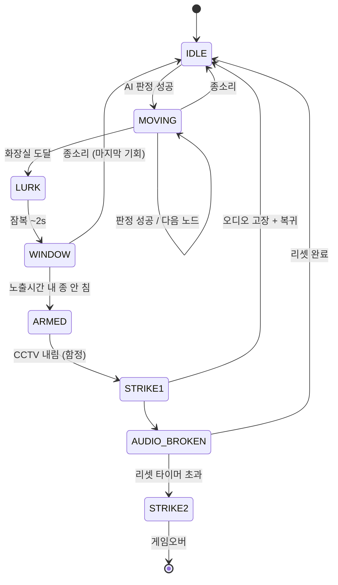

# 귀신 행동 상세 스펙 (구현용)

> 메인 GDD(독서실_경비_GDD.md)의 보조 문서. 귀신별 상태머신 · 경로 노드 · 전이 조건 · 필요 애니메이션/사운드를 구현 직전 수준으로 정리.
> 한 마리씩 추가해 나감.

---

# 0. 공통 AI 엔진 (전 귀신 공유)

> FNAF3 디컴파일 로직 기반. 모든 귀신은 아래 **2개 엔진** 중 하나를 쓰고, 차이는 **파라미터**로만 준다. 밸런싱 시 엔진 한 곳만 고치면 전체 적용.
> 공통 입력: **AI 레벨 = 8장 날짜별 곡선값.** 모든 시간은 초 단위로 재튜닝(레딧 프레임값 직역 금지).

## 엔진 A — 능동 빌런 (연호 전용)
매초 루프: `move_counter += (평소 1 / 흉포 2)` → 5개 임계값 전부 초과 시 행동 준비 → 굴림(평소 1~3 / 흉포 1~4) → `1=멈춤(+total_turns) · 2=후퇴 · 3=전진 · 4=급습(흉포만)` → 이동 시 `total_turns=0`.
- **흉포(aggressive) 토글:** 상황이 귀신을 흉포하게(연쇄 붕괴 엔진). 상세 §2.5.
- **total_turns 보정:** 실패 누적 → 다음 행동 가속(운빨 보정).
- 상세: §2.

## 엔진 B — 큐 기반 팬텀 (현승·현우·김욱 공유)
```
매 CYCLE(기본 20s)마다:
  if (대상 카메라를 안 보는 중) and (rand(0~9) < AI레벨):   # "AI in 10"
      해당 귀신을 특정 위치에 '큐(queue)'
  큐된 귀신이 화면에 노출되고:
      노출 시간 >= EXPOSURE_LIMIT (일별 단축) → "공격 예약(armed)"
  카메라를 안 보면 일부 귀신은 비활성/해제(귀신별 규칙)
강제 스폰: 지정 시각(또는 다음 조건 충족 시) 무조건 1회 큐
```
**귀신별 파라미터:**
| 귀신 | CYCLE | 큐 확률 | 대상/트리거 | 노출 결과 | 강제 스폰 | 비활성 조건 |
|---|---|---|---|---|---|---|
| 김욱 | 20s | rand(0~9)<AI | 특정 CAM 랜덤 | 응시 초과→마비 예약 | 3am류 1회 | 카메라 안 보면 해제 |
| 현승 | (이동형, 엔진 B는 '창문 노출' 단계에만 부분 적용) | — | 창문 | 노출 초과→ARMED | 1일 1회 확정 | — |
| 현우 | 20s | rand(0~9)<AI | 환풍구 CAM | 노출 누적→스택 | — | — |
> 현승은 본체가 이동형(§1)이라 엔진 B를 "창문/함정 단계"에만 빌려 씀. 현우는 이동(복도/방)은 자유, 환풍구 큐만 엔진 B.

---


# 1. 아현승 (튜토리얼 / 팬텀 + 퍼펫)

## 1.1 개요
- **거점:** 공부방1 (CAM 01)
- **성격:** 상시 위협. 1일차부터 활성. 모든 후속 귀신 설계의 기준 틀.
- **대응 수단:** 종소리(되돌림) + 오디오 리셋(퍼펫 방지)
- **결과:** 1차 = 오디오 고장(비치명) → 방치 시 2차 = 즉사

## 1.2 상태(State) 목록
| 상태 | 설명 | 위치 |
|---|---|---|
| `IDLE` | 공부방1에서 대기. 가끔 고개 듦/미동. | 공부방1 |
| `MOVING` | 루트 노드를 따라 이동. | 경로상 |
| `LURK` | 화장실(사각) 도달, 카메라에서 사라짐. 짧은 잠복. | 화장실 |
| `WINDOW` | 창문에 절뚝이며 등장(경고). 시간제한. | 관리실 창문 |
| `ARMED` | 창문 경고 후 "함정" 무장 상태. | (창문 부근) |
| `STRIKE1` | 팬텀 점프스케어 → 오디오 고장. | 화면 |
| `STRIKE2` | 퍼펫 강림 → 즉사. | 화면 |

> 별도 시스템 상태: `AUDIO_BROKEN`(오디오 고장 + 리셋 타이머 작동) — 현승 위치와 독립적으로 굴러감.

## 1.3 경로 노드 (CCTV 가시성 포함)
화장실은 카메라 없음(사각) + 환풍구 교차점 → 항상 마지막 블라인드 노드. 그 직후 창문(또는 환풍구 측면) 등장.
모든 방은 복도 허브로 연결(공부방1↔공부방2만 직접). 현승은 복도 기본, 가끔 환풍구.

- **R1 (짧음/급습):** 공부방1 `[CAM01]` → 복도 `[CAM]` → 화장실 `[사각]` → 창문
- **R2 (중간):** 공부방1 `[CAM01]` → 공부방2 `[CAM02]` → 복도 `[CAM]` → 화장실 `[사각]` → 창문
- **R3 (환풍구 변칙):** 공부방1 `[CAM01]` → 공부방2 `[CAM02]` → [환풍구] → 화장실 `[사각]` → [환풍구] → 관리실 측면

> 활성화 시 R1~R3 중 랜덤. R3는 가끔만(복도캠 건너뛰는 변칙 → 단조로움 해소). 환풍구는 몸집 작은 귀신 공용(연호 제외).

## 1.4 상태 전이 조건
| 전이 | 조건 |
|---|---|
| `IDLE → MOVING` | AI 판정 주기(일별 간격)마다 성공 시 활성화 |
| `MOVING → MOVING` | 판정 성공마다 다음 노드로 1칸 전진 |
| `MOVING → IDLE` | **종소리** (공부방1로 복귀) — 기본 대응 |
| `MOVING → LURK` | 화장실 노드 도달 |
| `LURK → WINDOW` | 잠복 시간(~2s) 경과 |
| `WINDOW → IDLE` | **종소리** (마지막 기회, 물러남) — 종 버튼은 CCTV 패널 안에 있음 |
| `WINDOW → ARMED` | 창문 노출 시간(~Xs) 동안 종 안 침 |
| `ARMED → STRIKE1` | **CCTV를 내리는 순간** (팬텀 함정 발동) |
| `STRIKE1 → IDLE` | 점프스케어 후 공부방1 복귀 + `AUDIO_BROKEN` 시작 |
| `AUDIO_BROKEN → 정상` | 리셋 패널 조작 완료 |
| `AUDIO_BROKEN → STRIKE2` | 리셋 타이머 초과 → 퍼펫 즉사(게임오버) |

> **캐스케이드 보강(팬텀 퍼펫 차용):** STRIKE1(오디오 고장) 발생 시 → 짧은 시간(예: ~10s) **CCTV/리셋 패널 일시 잠금 + 약한 시야 교란** → 그 틈에 **연호가 빠르게 전진**(흉포 토글 ON와 연계). "현승한테 당하면 연호가 그 틈을 탄다"가 실제 메커니즘으로 구현됨.

> **핵심 학습:** 창문(WINDOW) 단계 정답은 **종**(CCTV 패널 안 버튼). 대응 없이 카메라를 내리면 함정(STRIKE1). → "현승이 창문에 오면 카메라에 숨지 말고 종을 쳐라."
> **카메라 숨기 봉쇄:** 카메라를 안 내리고 버티면 STRIKE 회피 가능하지만 → ①전력 고갈(정전) ②**연호가 코앞에 오면 카메라 강제 다운** → 숨기 무력화. (연호 상세에서 본격 설계)

## 1.4-b 1일차 교육 (죽음 없음 + 환경 학습)
- **CCTV 첫 작동 시:** 모니터에 붙은 **손글씨 포스트잇**이 화면에 보임 — *"소리나면 벨 눌러요(화면 안에 있음). 환기 가끔 리셋. 별일 없을 거임"*. 실시간 코칭 문자 없음(감시 느낌 배제).
- **현승 1회 확정 출현**(스크립트 보장) — 모든 플레이어가 반드시 1회 경험.
- **1일차는 STRIKE가 죽이지 않음:** 종을 일찍 치면 정석 학습, 안 쳐서 카메라 내려 STRIKE1 떠도 점프스케어만(오디오 고장 정도, 즉사 X). 2일차부터 실전.

## 1.5 필요 애니메이션
| # | 애니메이션 | 용도 | 우선도 |
|---|---|---|---|
| A1 | 대기(IDLE) — 책상에서 미동/고개 듦 | CAM01 평상시 | 필수 |
| A2 | 걷기(MOVING) 사이클 | 노드 이동 | 필수 |
| A3 | 창문 절뚝 워크패스(WINDOW) | 시그니처 경고 연출 | **최우선** |
| A4 | 팬텀 점프스케어(STRIKE1) | 1차, 화면 덮침 | 필수 |
| A5 | 퍼펫 강림 즉사(STRIKE2) | 2차, 느리게 다가오는 톤 | 필수 |
| A6 | 종 반응 — 돌아서는 모션 | 되돌림 피드백 | 선택(있으면 좋음) |

## 1.6 필요 사운드
| # | 사운드 | 트리거 |
|---|---|---|
| S1 | 정적 앰비언트(연필/페이지 — "정적 속 공부하던 애") | IDLE |
| S2 | 절뚝이는 발소리(끄는 듯 불균형) | MOVING / WINDOW |
| S3 | 종 반응 큐(한숨/움직임) | 종 되돌림 |
| S4 | 팬텀 점프스케어 스팅 | STRIKE1 |
| S5 | 퍼펫 즉사 스팅(저음/길게) | STRIKE2 |
| S6 | 오디오 고장 앰비언트(지직/왜곡) | AUDIO_BROKEN 동안 |

## 1.7 상태 다이어그램


## 1.8 미정 / 튜닝값
- 창문 노출시간(ARMED 진입까지) — 일별로 짧아짐
- 잠복(LURK) 시간
- 오디오 리셋 타이머 (8장 테이블: 1일 ~10s → 5일 ~5s)
- 종 사거리/쿨타임 (전역 — 메인 GDD 11장)
- R1/R2/R3 선택 가중치

---

# 2. 노연호 (메인 빌런 / 스프링트랩 엔진)

> FNAF3 스프링트랩 디컴파일 로직을 기반으로 우리 게임에 맞게 재구성. 연호의 모든 공포는 **"흉포 토글 + 행동 굴림 + 실패 보정"** 하나의 엔진에서 자동으로 흘러나온다. 5종 패턴은 별도 스크립트가 아니라 이 엔진의 출력이다.

## 2.1 개요
- **거점:** 공부방2. 가장 자주 이동. 환풍구 사용 불가(몸집) → 항상 복도/문으로만.
- **등장:** 2일차(맛보기 1회) → 3일차(약) → 5일(풀). AI 레벨 = 8장 곡선(2/5/9/16…).
- **대응:** 종(되돌림) — 단, **종 무시 확률** 존재. 무시당해도 즉사 아님(아래).
- **당하면:** **즉사** (후폭풍 없음, 유일).
- **정공법 빌런:** 항상 정면 창문으로 수렴(현우=환풍구 측면과 대비).

## 2.2 루트 (전부 창문 수렴, 맵 인접 준수)
- **L1 (정면/로비):** 공부방2 → 복도 → 로비 → 복도 → 관리실 창문
- **L2 (공부방1 경유):** 공부방2 → 공부방1 → 복도 → 화장실 → 관리실 창문
- **L3 (화장실 잠복):** 공부방2 → 복도 → 화장실 → (잠복) → 관리실 창문
> 루트는 분기 시작용일 뿐, 진짜 다양성은 §2.4 행동 엔진에서 나온다. "창고 사라짐"은 L3 화장실 잠복으로 대체.

## 2.3 핵심 엔진 — 이동 판정 (스프링트랩식)
매초 진행되는 루프:
1. **move_counter** += (평소 1 / 흉포 2) per second
2. 매초 move_counter를 **5개 임계값과 비교** → 전부 초과 시 "행동 준비됨"
3. 준비되면 **행동 굴림:**
   - 평소(aggressive=0): `1~3` 중 랜덤
   - 흉포(aggressive=1): `1~4` 중 랜덤
4. 굴림 결과:
   - **1 = 실패(멈춤)** → 그 자리 유지 + `total_turns += 1`
   - **2 = 후퇴** → 이전 노드로 (멀어짐)
   - **3 = 전진** → 다음 노드로 (다가옴)
   - **4 = 급습(흉포 전용)** → 여러 노드 빠르게 주파 / 페이크
5. 실제 이동(2·3·4) 시 `total_turns = 0`

> **total_turns 보정:** 실패(1)가 누적될수록 다음 "준비"가 빨라짐(임계값 더 빨리 넘김). → 운으로 영원히 안 옴/연속 순삭 방지. 공정성 자동 확보.

## 2.4 5종 패턴 = 엔진 출력 매핑
| 패턴 | 엔진에서 발생 | 잠금 해제 |
|---|---|---|
| ① 멈춤 | 굴림=1 | 2일~ |
| ② 종 무시 | 종 입력 시 확률 판정(아래) | 2일~ (핵심 각인) |
| ③ 페이크 | 굴림=4 중 "창문 근접 후 2(후퇴)" 연계 | 4일~ |
| ④ 화장실 잠복 | L3 진입 + 굴림=1 연속 | 3일~ |
| ⑤ 급가속 | 굴림=4 (흉포 전용) | 5일~ (흉포 빈발) |
> 날짜 잠금은 "흉포 발동 빈도 + AI 레벨"로 자연 구현됨(4는 흉포에서만 나오므로 후반에 잦아짐).

## 2.5 흉포(aggressive) 토글 — 연쇄 붕괴의 엔진
**aggressive = 0/1.** 매 15초 0으로 리셋되지만, 조건 충족 시 즉시 다시 1. 2일차(맛보기) 밤 시작엔 항상 0.
**흉포로 만드는 조건 (우리 연쇄 붕괴와 직결):**
- **현승에게 당함**(오디오 고장/팬텀 스트라이크) → 흉포
- **김욱에게 당함**(환기/산소 마비) → 흉포
- **새벽 4~5시** → 흉포
- **관리실에 10초+ 가만히**(아무 조작 없음) → 흉포 (방심 처벌)
- **확률:** 매 15초 `rand(0~4) < AI레벨` 이면 흉포 (후반 날일수록 자주)

> 효과: 흉포일 때만 굴림에 **4(급습/페이크)** 가 추가됨 → 평소 얌전하다 표변. "현승/김욱한테 당하면 연호가 미쳐 날뛴다"는 캐스케이드가 이 토글로 구현됨.

## 2.6 종 무시 (확률, 즉사 아님)
- 종 침 → **무시 확률 판정.** 성공=후퇴 / **실패(무시)=안 물러나고 자리 유지(전진은 안 함)**
- 무시당하면 **다시 쳐야 함** → 종 쿨(3~4초) + 전력 소모 누적 → **자원/타이밍 압박** (즉사 아님)
- 무시 확률: 초반 낮음 → 후반 높음 (8장 "종 무시 시간/저항" 곡선)
- **실제 즉사 조건:** 무시 운이 아니라 → **연호가 창문 도달 후 종 대응을 놓쳤을 때**(반응 실패 = 공정). 운으로 죽지 않음.

## 2.7 카메라 강제 다운 (숨기 봉쇄)
- 현승 함정("카메라 내리면 죽음") 회피로 **카메라를 계속 켜두는 플레이** 차단용.
- **연호가 창문 근접(마지막 노드 도달)** 하면 → **CCTV 패널 강제 다운** → 숨어있던 현승 함정 발동 가능 + 연호 본인 대응 강제.
- 즉 "카메라에 숨기"는 단기만 가능, 연호가 오면 강제로 끌려 나옴.

## 2.8 필요 애니메이션
| # | 애니메이션 | 용도 | 우선도 |
|---|---|---|---|
| B1 | 대기(공부방2) | 평상시 | 필수 |
| B2 | 걷기 사이클(느림/흉포 빠름 2종) | 이동 | 필수 |
| B3 | 화장실 잠복 진입/응시 | L3 사라짐 | 필수 |
| B4 | 창문 등장(정면, 위협적) | 창문 수렴 | **최우선** |
| B5 | 즉사 점프스케어(메인 빌런급, 긴 연출) | 사망 | **최우선** |
| B6 | 종 무시 모션(안 물러나고 노려봄) | 종 저항 피드백 | 필수(차별점) |
| B7 | 흉포 전환(표변하는 순간) | aggressive 0→1 | 선택(있으면 임팩트) |

## 2.9 필요 사운드
| # | 사운드 | 트리거 |
|---|---|---|
| C1 | 무거운 발소리(평소/흉포 2종) | 이동 |
| C2 | 종 무시 큐(낮은 그르렁/노려봄) | 종 실패 |
| C3 | 흉포 전환 스팅 | aggressive 0→1 |
| C4 | 창문 근접 경고음 | 창문 도달 |
| C5 | 즉사 스팅(메인 빌런, 길고 강하게) | 사망 |

## 2.10 미정 / 튜닝값
- move_counter 임계값 5개 (초 단위로 재설계 — 프레임값 직역 금지)
- 종 무시 확률 곡선 (일별)
- 흉포 확률 `rand(0~4) < AI` 의 AI 매핑
- 급습(4) 시 주파 노드 수
- 카메라 강제 다운 트리거 거리

---

# 3. 김욱 (벌룬보이 / 엔진 B — 큐 기반 팬텀)

> 팬텀 BB + 팬텀 처카 로직을 거의 직수입. 본인은 무해, **빈틈을 강제하는 enabler.**

## 3.1 개요
- **등장:** 3일차~. 이동 없음. CCTV 안에서만 작동.
- **대응:** 큐된 카메라를 **응시 → 일정 시간 뒤 스스로 사라짐.** 응시 중 다른 카메라 감시 불가(트레이드오프).
- **실수 시:** 큐된 상태로 CCTV를 내리거나 다른 카메라로 넘김 → 갑툭튀 + **산소순환장치 마비.**
- **당하면(마비):** 질식 타이머 → 리셋 필요(무방비 시간).

## 3.2 엔진 B 파라미터
- **CYCLE:** 20s
- **큐 확률:** `rand(0~9) < AI레벨` (3일 낮음 → 5일 높음, 8장 곡선)
- **대상:** 7대 중 랜덤 CAM (노이즈 신호로 표시)
- **노출 결과:** 응시(EXPOSURE) **달성 시 스스로 퇴장**(BB식 — 응시가 정답). 응시 실패(내림/전환) 시 → 마비.
- **강제 스폰:** 지정 새벽 시각(예: 3am류) 또는 다음에 카메라 안 볼 때 1회 무조건 큐.
- **비활성:** 카메라 안 보면 해제(다음 CYCLE 재큐 가능).

> 김욱은 "응시 시간 충족=퇴장"이라 현승/연호의 "노출=공격"과 **반대 방향**(노출이 안전). 같은 엔진 B의 파라미터 반전으로 구현.

## 3.3 필요 애니메이션 / 사운드
| # | 애니메이션 | 용도 |
|---|---|---|
| D1 | 카메라 응시(가만히 노려봄) | 큐 노출 |
| D2 | 마비 갑툭튀(짧고 놀래키는) | 응시 실패 |
| # | 사운드 | 트리거 |
| E1 | 큐 신호(지직/노이즈) | 카메라에 큐됨 |
| E2 | 마비 스팅 + 환기 멈추는 소리 | 응시 실패 |

## 3.4 미정 / 튜닝값
- 필요 응시 시간(3일 ~2s → 5일 ~4s, 8장)
- 강제 스폰 시각
- 마비 후 질식 타이머 / 리셋 소요시간 (전역)

---
